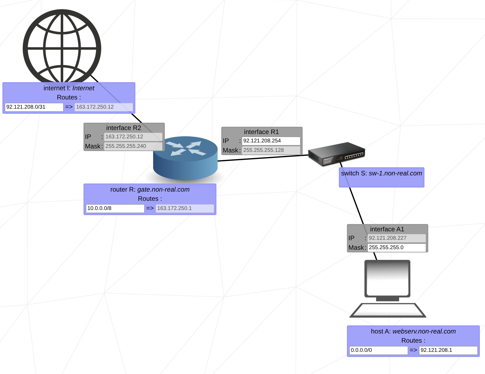

# Netpractice

| Class | First Octet  | Subnet Mask        | No. Networks         | Hosts Network | Purpose / Example                       |
| :---- | :----------- | :----------------- | :------------------- | :------------ | :-------------------------------------- |
| A     | 1 – 126      | 255.0.0.0 (/8)     | 128 (minus reserved) | 16,777,214    | Very large networks (e.g. 10.0.0.0)     |
| B     | 128 – 191    | 255.255.0.0 (/16)  | 16,384               | 65,534        | Medium-sized networks (e.g. 172.16.0.0) |
| C     | 192 – 223    | 255.255.255.0 (/24)| 2,097,152            | 254           | Small networks (e.g. 192.168.1.0)       |
| D     | 224 – 239    | N/A                | N/A                  | N/A           | Multicasting (e.g. 224.0.0.1)           |
| E     | 240 – 255    | N/A                | N/A                  | N/A           | Experimental / Research                 |

| Address                     | Meaning                      |
| :-------------------------- | :--------------------------- |
| 0.0.0.0                     | Default route / unspecified  |
| 127.0.0.0 – 127.255.255.255 | Loopback (localhost)         |
| 169.254.0.0/16              | APIPA (Automatic Private IP) |
| 255.255.255.255             | Broadcast address            |

| bit table|     |    |    |    |   |   |   |   |
| :--------|:----|:---|:---|:---|:--|:--|:--|:--|
| bit      | 8   | 7  | 6  | 5  | 4 | 3 | 2 | 1 |
| value    | 128 | 64 | 32 | 16 | 8 | 4 | 2 | 1 |

## Level 1

This exercise has 4 computers (A1 and B1) in one network and (C1 and D1) in another network.
The goal is make the comunication between computers on the same network.

Every computer on the same network has the same mask.

### Network AB
B1 has the given Ip: 104.97.23.12 so the A1 should have and IP from 104.97.23.1 to 104.97.23.254

- Interface A1
ip: from 104.97.23.1 to 104.97.23.254
mask: 255.255.255.0
- Interface B1
ip: 104.97.23.12
mask: 255.255.255.0

| Before                |                        | | After                 |                        |
|:--------------------- |:---------------------- |-|:--------------------- |:---------------------- |
| Interface A1          | Interface B1           |-| Interface A1          | Interface B1           |
| ip: xxx.xxx.xxx.xxx   | ip: 104.97.23.12       |-| ip: 104.97.23.12      | ip: 104.97.23.12       |
| mask: 255.255.255.0   | masks: 255.255.255.0   |-| mask: 255.255.255.0   | masks: xxx.xxx.xxx.xxx |

### Network CD

C1 is given the ip and mask. The mask should be the same in both hosts.
To find the ip of D1 you need to calculate the bits

c1:   211.191.109.75
mask: 255.255.0.0

255 means the number should remain and 0 means the number can vary from 0-255 excluding first and last.
so the D1 IP: 211.191.1.1 to 211.191.254.254

- Interface C1
ip: 211.191.109.75
mask: 255.255.0.0
- Interface D1
ip: 211.191.1.1 to 211.191.254.254
mask: 255.255.0.0

## Level 2

- Interface A1
ip:
mask: 255.255.255.224
- Interface B1
ip: 192.168.101.222
maks:
- Interface C1
ip:
mask: 255.255.255.252
- Interface D1
ip:
mask: /30

| Before                |                        |                       |                       |
|:---------------------:|:---------------------- |:--------------------- |:--------------------- |
| Interface A1          | Interface B1           | Interface C1          | Interface D1          |
| ip:   xxx.xxx.xxx.xxx | ip:    192.168.101.222 | ip:   xxx.xxx.xxx.xxx | ip: xxx.xxx.xxx.xxx   |
| mask: 255.255.255.224 | masks: xxx.xxx.xxx.xxx | mask: 255.255.255.252 | masks: /30            |

### Network AB

| Before                |                       | | After                 |                       |
|:---------------------:|:---------------------:|-|:---------------------:|:---------------------:|
| Interface A1          | Interface B1          |-| Interface A1          | Interface B1          |
| ip: xxx.xxx.xxx.xxx   | ip: 192.168.101.222   |-| ip: 192.168.101.221   | ip: 192.168.101.222   |
| mask: 255.255.255.224 | masks: xxx.xxx.xxx.xxx|-| mask: 255.255.255.224 | masks: 255.255.255.224|

First the mask should be the same for the network.
Now to find the ip range I know already the 3 first octects of ip A1 should be the same as ip b1

ip A1: 192.168.101.xxx

to find the range we need to use bit table
Starting from left to right if the value fits in the last octet the bit will be 1

| bit table|     |    |    |    |   |   |   |   |
| :--------|:----|:---|:---|:---|:--|:--|:--|:--|
| bit      | 8   | 7  | 6  | 5  | 4 | 3 | 2 | 1 |
| value    | 128 | 64 | 32 | 16 | 8 | 4 | 2 | 1 |
| 224      | 1   | 1  | 1  | 0  | 0 | 0 | 0 | 0 |

Step 1: Understand the subnet

Mask : 255.255.255.224 = /27.
the mask on bits: 11111111.11111111.11111111.11100000
counting the 1 give the CIDR notation = 27.

That means each subnet has 32 IP addresses (30 usable for hosts).

To find B1’s subnet, let’s find the network address for 192.168.101.222/27.

| Subnet Range	    | Network Address	| Broadcast	        | Usable IPs                        |
|:----------------- |:----------------- |:----------------- |:--------------------------------- |
| 192.168.101.0/27	| 192.168.101.0	    | 192.168.101.31	| 192.168.101.1 – 192.168.101.30    |
| 192.168.101.32/27	| 192.168.101.32	| 192.168.101.63	| 192.168.101.33 – 192.168.101.62   |
| 192.168.101.64/27	| 192.168.101.64	| 192.168.101.95	| 192.168.101.65 – 192.168.101.94   |
| 192.168.101.96/27	| 192.168.101.96	| 192.168.101.127	| 192.168.101.97 – 192.168.101.126  |
| 192.168.101.128/27| 192.168.101.128	| 192.168.101.159	| 192.168.101.129 – 192.168.101.158 |
| 192.168.101.160/27| 192.168.101.160	| 192.168.101.191	| 192.168.101.161 – 192.168.101.190 |
| 192.168.101.192/27| 192.168.101.192	| 192.168.101.223	| 192.168.101.193 – 192.168.101.222 |
| 192.168.101.224/27| 192.168.101.224	| 192.168.101.255	| 192.168.101.225 – 192.168.101.254 |

the Ip of B1 belongs to the range of 192.168.101.193 – 192.168.101.222

## Network CD

| Before                |                       | | After                 |                       |
|:--------------------- |:--------------------- |-|:--------------------- |:--------------------- |
| Interface C1          | Interface D1          |-| Interface C1          | Interface D1          |
| ip: xxx.xxx.xxx.xxx   | ip: xxx.xxx.xxx.xxx   |-| ip: xxx.xxx.xxx.xxx   | ip: xxx.xxx.xxx.xxx   |
| mask: 255.255.255.252 | masks: /30            |-| mask: 255.255.255.252 | masks: /30            |

Again every net has the same mask.
mask:          255.     255.     255.     252
bit mask: 11111111.11111111.11111111.11111100

For the ip number it can be any number on the default ips.

| bit table|     |    |    |    |   |   |   |   |
| :--------|:----|:---|:---|:---|:--|:--|:--|:--|
| bit      | 8   | 7  | 6  | 5  | 4 | 3 | 2 | 1 |
| value    | 128 | 64 | 32 | 16 | 8 | 4 | 2 | 1 |
| 252      | 1   | 1  | 1  | 1  | 1 | 1 | 0 | 0 |

## Level 3

| Before                |                       |                       |
|:---------------------:|:---------------------:|:---------------------:|
| Interface A1          | Interface B1          | Interface C1          |
| ip: 104.198.97.125    | ip: xxx.xxx.xxx.xxx   | ip: xxx.xxx.xxx.xxx   |
| mask: xxx.xxx.xxx.xxx | masks: xxx.xxx.xxx.xxx| mask: 255.255.255.128 |

| After                 |                       |                       |
|:---------------------:|:---------------------:|:---------------------:|
| Interface A1          | Interface B1          | Interface C1          |
| ip: 104.198.97.125    | ip: 104.198.97.124    | ip: 104.198.97.126    |
| mask: 255.255.255.128 | masks: 255.255.255.128| mask: 255.255.255.128 |

The information I have are the ip o A1 and the mask of C1.
The mask should be the same for all components of the net(255.255.255.128).

To find the ip I use the last octec of the mask to find the range it belongs

| bit table|     |    |    |    |   |   |   |   |
| :--------|:----|:---|:---|:---|:--|:--|:--|:--|
| bit      | 8   | 7  | 6  | 5  | 4 | 3 | 2 | 1 |
| value    | 128 | 64 | 32 | 16 | 8 | 4 | 2 | 1 |
| 128      | 1   | 0  | 0  | 0  | 0 | 0 | 0 | 0 |

mask:          255.     255.     255.    128 
bit mask: 11111111.11111111.11111111.10000000 -> /25

this means I can split in two subnets each with 128 ips

| **Subnet**   | **Network Address** | **Usable Host Range**           | **Broadcast Address** | **Total Usable Hosts** |
| :----------- | :------------------ | :------------------------------ | :-------------------- | :--------------------  |
| **Subnet 1** | 104.198.97.0        | 104.198.97.1 – 104.198.97.126   | 104.198.97.127        |           126          |
| **Subnet 2** | 104.198.97.128      | 104.198.97.129 – 104.198.97.254 | 104.198.97.255        |           126          |

Now the Ip of A1 belongs to subnet 1 this means the last octect of the ip should range from 104.198.97.1 – 104.198.97.126.

## Level 4

| Before                |                        |                       |                       |                       |
|:--------------------- |:---------------------- |:--------------------- |:--------------------- |:--------------------- |
| Interface A1          | Interface B1           | Interface R1          | Interface R2          | Interface R3          |
| ip:   103.153.114.132 | ip:    xxx.xxx.xxx.xxx | ip:   xxx.xxx.xxx.xxx | ip:   103.153.114.1   | ip:   103.153.114.244 |
| mask: xxx.xxx.xxx.xxx | masks: xxx.xxx.xxx.xxx | mask: xxx.xxx.xxx.xxx | mask: 255.255.255.128 | mask: 255.255.255.192 |

| After                 |                        |                       |                       |                       |
|:--------------------- |:---------------------- |:--------------------- |:--------------------- |:--------------------- |
| Interface A1          | Interface B1           | Interface R1          | Interface R2          | Interface R3          |
| ip:   103.153.114.132 | ip:    103.153.114.131 | ip:   103.153.114.130 | ip:   103.153.114.1   | ip:   103.153.114.244 |
| mask: xxx.xxx.xxx.xxx | masks: xxx.xxx.xxx.xxx | mask: xxx.xxx.xxx.xxx | mask: 255.255.255.128 | mask: 255.255.255.192 |

- Solving the IP:
Interface A1 and B1 are connectec to interface R1 via switch. A1_IP is given (103.153.114.132) so the B1_IP and R1_IP should
be similar (103.153.114.130). The key fact here is that the A1_IP given belongs to class A (255.xxx.xxx.xxx)so any number from
1-254 will fit on the last octec. 

- Solving the Mask:
The mask in this case can be any number starting from CIDR:/1 or 128.0.0.0.

## Level 5

| Before                 |                        |                        |
|:---------------------- |:---------------------- |:---------------------- |
| Interface A1           | Host A                 | Interface R1           |
| ip:    xxx.xxx.xxx.xxx | from:  xxx.xxx.xxx.xxx | ip:    042.201.037.126 |
| masks: xxx.xxx.xxx.xxx | to  :  xxx.xxx.xxx.xxx | masks: 255.255.255.128 |
|:---------------------- |:---------------------- |:---------------------- |
| Interface B1           | Host B                 | Interface R2           |
| ip:    xxx.xxx.xxx.xxx | from:  default         | ip:    167.076.135.254 |
| masks: xxx.xxx.xxx.xxx | to  :  xxx.xxx.xxx.xxx | masks: 255.255.192.000 |

There is 2 networks here B1-R2 and A1-R1. The hostmachine A and B /from/ value is default and the /to/ value should be the ip
of the interface R1 and R2 respectively.
As both IP and masks are know from R1-R2 it is easy to understand that the mask should be the same for each network and 
ip should be on value below the last octec.

| Solution               |                        |                        |
|:---------------------- |:---------------------- |:---------------------- |
| Interface A1           | Host A                 | Interface R1           |
| ip:    042.201.037.125 | from:  default         | ip:    042.201.037.126 |
| masks: 255.255.255.128 | to  :  042.201.037.126 | masks: 255.255.255.128 |
|:---------------------- |:---------------------- |:---------------------- |
| Interface B1           | Host B                 | Interface R2           |
| ip:    167.076.135.253 | from:  default         | ip:    167.076.135.254 |
| masks: 255.255.192.000 | to  :  167.076.135.254 | masks: 255.255.192.000 |

## Level 6

| Before                 |                         |                        |
|:---------------------- |:----------------------- |:---------------------- |
| Host A                 | Interface A1            | Interface R1           |
| from:  xxx.xxx.xxx.xxx | ip:    092.121.208.227  | ip:   xxx.xxx.xxx.xxx  |
| to  :  xxx.xxx.xxx.xxx | masks: xxx.xxx.xxx.xxx  | mask: 255.255.255.128  |
|:---------------------- |:----------------------- |:---------------------- |
| Interface R2           | Router R                | Internet               |
| ip:   163.172.250.12   | from:  xxx.xxx.xxx.xxx  | from:  xxx.xxx.xxx.xxx |
| mask: 255.255.255.240  | to  :  163.172.250.1    | to  :  163.172.250.12  |
