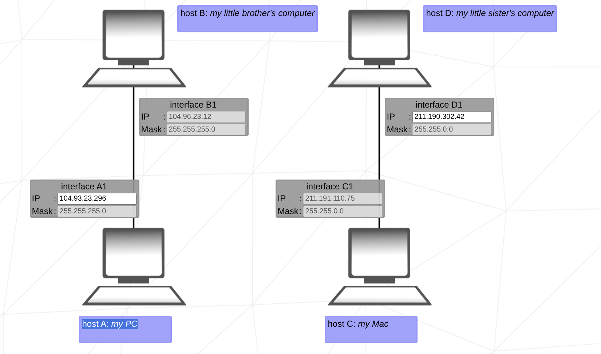
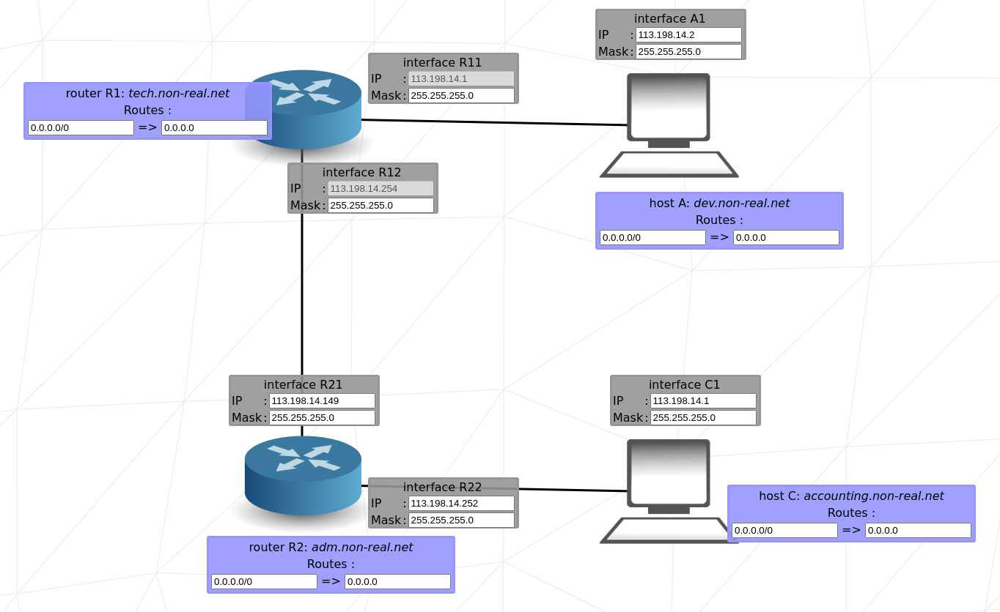

# Netpractice

## Important tables

Class ip table:
| Class | First Octet  | Subnet Mask          | No. Networks         | Hosts Network | Purpose / Example                       |
| :---- | :----------- | :------------------- | :------------------- | :------------ | :-------------------------------------- |
| A     | 1 – 126      | 255.000.000.000 (/8) | 128 (minus reserved) | 16,777,214    | Very large networks (e.g. 10.0.0.0)     |
| B     | 128 – 191    | 255.255.000.000 (/16)| 16,384               | 65,534        | Medium-sized networks (e.g. 172.16.0.0) |
| C     | 192 – 223    | 255.255.255.000 (/24)| 2,097,152            | 254           | Small networks (e.g. 192.168.1.0)       |
| D     | 224 – 239    | N/A                  | N/A                  | N/A           | Multicasting (e.g. 224.0.0.1)           |
| E     | 240 – 255    | N/A                  | N/A                  | N/A           | Experimental / Research                 |

| CIDR  | Dot-decimal     | Number of IP-addresses  per subnet | Usable IP-addresses   per subnet | Number of subnets |
| :---: | :-----------:   | :-------------------------------------: | :-----------------------------------: | :---------------: |
| /32   | 255.255.255.255 | 1                                       | 0                                     | 256               |
| /31   | 255.255.255.254 | 2                                       | 0                                     | 128               |
| /30   | 255.255.255.252 | 4                                       | 2                                     | 64                |
| /29   | 255.255.255.248 | 8                                       | 6                                     | 32                |
| /28   | 255.255.255.240 | 16                                      | 14                                    | 16                |
| /27   | 255.255.255.224 | 32                                      | 30                                    | 8                 |
| /26   | 255.255.255.192 | 64                                      | 62                                    | 4                 |
| /25   | 255.255.255.128 | 128                                     | 126                                   | 2                 |
| /24   | 255.255.255.0   | 256                                     | 254                                   | 1                 |

| Address                     | Meaning                      |
| :-------------------------- | :--------------------------- |
| 0.0.0.0                     | Default route / unspecified  |
| 127.0.0.0 – 127.255.255.255 | Loopback (localhost)         |
| 169.254.0.0/16              | APIPA (Automatic Private IP) |
| 255.255.255.255             | Broadcast address            |

| bit table|     |    |    |    |   |   |   |   |
| :------- |:--- |:-- |:-- |:-- |:- |:- |:- |:- |
| bit      | 8   | 7  | 6  | 5  | 4 | 3 | 2 | 1 |
| value    | 128 | 64 | 32 | 16 | 8 | 4 | 2 | 1 |

## Level 1

This exercise has 4 computers (A1 and B1) in one network and (C1 and D1) in another network.
The goal is make the comunication between computers on the same network.

Every computer on the same network has the same mask.

### Network AB
B1 has the given Ip: 104.97.23.12 so the A1 should have and IP from 104.97.23.1 to 104.97.23.254

- Interface A1
ip: from 104.97.23.1 to 104.97.23.254
mask: 255.255.255.0
- Interface B1
ip: 104.97.23.12
mask: 255.255.255.0

| Before                |                        |                       |                        |
|:--------------------- |:---------------------- |:--------------------- |:---------------------- |
| Interface A1          | Interface B1           | Interface C1          | Interface D1           |
| ip:   xxx.xxx.xxx.xxx | ip:    104.097.023.012 | ip:   211.191.110.075 | ip:    xxx.xxx.xxx.xxx |
| mask: 255.255.255.000 | masks: 255.255.255.000 | mask: 255.255.255.000 | masks: 255.255.255.000 |

| Solution              |                        |                       |                        |
|:--------------------- |:---------------------- |:--------------------- |:---------------------- |
| Interface A1          | Interface B1           | Interface A1          | Interface B1           |
| ip:   104.097.023.011 | ip:    104.097.023.012 | ip:   211.191.110.075 | ip:    104.097.023.012 |
| mask: 255.255.255.000 | masks: 255.255.255.000 | mask: 255.255.000.000 | mask:  255.255.000.000 |

### Network CD

C1 is given the ip and mask. The mask should be the same in both hosts.
To find the ip of D1 you need to calculate the bits

c1:   211.191.109.075
mask: 255.255.000.000

255 means the number should remain and 0 means the number can vary from 0-255 excluding first and last.
so the D1 IP: 211.191.001.001 to 211.191.254.254

- Interface C1
ip:   211.191.109.075
mask: 255.255.000.000
- Interface D1
ip:  211.191.1.1 to 211.191.254.254
mask: 255.255.0.0

## Level 2

- Interface A1
ip:
mask: 255.255.255.224
- Interface B1
ip: 192.168.101.222
maks:
- Interface C1
ip:
mask: 255.255.255.252
- Interface D1
ip:
mask: /30

| Before                |                        |                       |                       |
|:---------------------:|:---------------------- |:--------------------- |:--------------------- |
| Interface A1          | Interface B1           | Interface C1          | Interface D1          |
| ip:   xxx.xxx.xxx.xxx | ip:    192.168.101.222 | ip:   xxx.xxx.xxx.xxx | ip: xxx.xxx.xxx.xxx   |
| mask: 255.255.255.224 | masks: xxx.xxx.xxx.xxx | mask: 255.255.255.252 | masks: /30            |

### Network AB

| Before                |                       | | After                 |                       |
|:---------------------:|:---------------------:|-|:---------------------:|:---------------------:|
| Interface A1          | Interface B1          |-| Interface A1          | Interface B1          |
| ip: xxx.xxx.xxx.xxx   | ip: 192.168.101.222   |-| ip: 192.168.101.221   | ip: 192.168.101.222   |
| mask: 255.255.255.224 | masks: xxx.xxx.xxx.xxx|-| mask: 255.255.255.224 | masks: 255.255.255.224|

First the mask should be the same for the network.
Now to find the ip range I know already the 3 first octects of ip A1 should be the same as ip b1

ip A1: 192.168.101.xxx

to find the range we need to use bit table
Starting from left to right if the value fits in the last octet the bit will be 1

| bit table|     |    |    |    |   |   |   |   |
| :------- |:--- |:-- |:-- |:-- |:- |:- |:- |:- |
| bit      | 8   | 7  | 6  | 5  | 4 | 3 | 2 | 1 |
| value    | 128 | 64 | 32 | 16 | 8 | 4 | 2 | 1 |
| 224      | 1   | 1  | 1  | 0  | 0 | 0 | 0 | 0 |

Step 1: Understand the subnet

Mask : 255.255.255.224 = /27.
the mask on bits: 11111111.11111111.11111111.11100000
counting the 1 give the CIDR notation = 27.

That means each subnet has 32 IP addresses (30 usable for hosts).

To find B1’s subnet, let’s find the network address for 192.168.101.222/27.

| Subnet Range	     | Network Address	| Broadcast	      | Usable IPs                        |
|:------------------ |:---------------- |:--------------- |:--------------------------------- |
| 192.168.101.000/27 | 192.168.101.000	| 192.168.101.031 | 192.168.101.001 – 192.168.101.030 |
| 192.168.101.032/27 | 192.168.101.032	| 192.168.101.063 | 192.168.101.033 – 192.168.101.062 |
| 192.168.101.064/27 | 192.168.101.064	| 192.168.101.095 | 192.168.101.065 – 192.168.101.094 |
| 192.168.101.096/27 | 192.168.101.096	| 192.168.101.127 | 192.168.101.097 – 192.168.101.126 |
| 192.168.101.128/27 | 192.168.101.128	| 192.168.101.159 | 192.168.101.129 – 192.168.101.158 |
| 192.168.101.160/27 | 192.168.101.160	| 192.168.101.191 | 192.168.101.161 – 192.168.101.190 |
| 192.168.101.192/27 | 192.168.101.192	| 192.168.101.223 | 192.168.101.193 – 192.168.101.222 |
| 192.168.101.224/27 | 192.168.101.224	| 192.168.101.255 | 192.168.101.225 – 192.168.101.254 |

the Ip of B1 belongs to the range of 192.168.101.193 – 192.168.101.222

## Network CD

| Before                |                       | | After                 |                       |
|:--------------------- |:--------------------- |-|:--------------------- |:--------------------- |
| Interface C1          | Interface D1          |-| Interface C1          | Interface D1          |
| ip:   xxx.xxx.xxx.xxx | ip: xxx.xxx.xxx.xxx   |-| ip:   xxx.xxx.xxx.xxx | ip: xxx.xxx.xxx.xxx   |
| mask: 255.255.255.252 | masks: /30            |-| mask: 255.255.255.252 | masks: /30            |

Again every net has the same mask.
mask:          255.     255.     255.     252
bit mask: 11111111.11111111.11111111.11111100

For the ip number it can be any number on the default ips.

| bit table|     |    |    |    |   |   |   |   |
| :------- |:--- |:-- |:-- |:-- |:- |:- |:- |:- |
| bit      | 8   | 7  | 6  | 5  | 4 | 3 | 2 | 1 |
| value    | 128 | 64 | 32 | 16 | 8 | 4 | 2 | 1 |
| 252      | 1   | 1  | 1  | 1  | 1 | 1 | 0 | 0 |

## Level 3

| Before                |                        |                       |
|:--------------------- |:---------------------- |:--------------------- |
| Interface A1          | Interface B1           | Interface C1          |
| ip:   104.198.097.125 | ip:    xxx.xxx.xxx.xxx | ip:   xxx.xxx.xxx.xxx |
| mask: xxx.xxx.xxx.xxx | masks: xxx.xxx.xxx.xxx | mask: 255.255.255.128 |

| After                 |                        |                       |
|:--------------------- |:---------------------- |:--------------------- |
| Interface A1          | Interface B1           | Interface C1          |
| ip:   104.198.097.125 | ip:    104.198.097.124 | ip:   104.198.97.126  |
| mask: 255.255.255.128 | masks: 255.255.255.128 | mask: 255.255.255.128 |

The information I have are the ip o A1 and the mask of C1.
The mask should be the same for all components of the net(255.255.255.128).

To find the ip I use the last octec of the mask to find the range it belongs

| bit table|     |    |    |    |   |   |   |   |
| :------- |:--- |:-- |:-- |:-- |:- |:- |:- |:- |
| bit      | 8   | 7  | 6  | 5  | 4 | 3 | 2 | 1 |
| value    | 128 | 64 | 32 | 16 | 8 | 4 | 2 | 1 |
| 128      | 1   | 0  | 0  | 0  | 0 | 0 | 0 | 0 |

mask:          255.     255.     255.    128 
bit mask: 11111111.11111111.11111111.10000000 -> /25

this means I can split in two subnets each with 128 ips

| Subnet   | Network Address | Usable Host Range                 | Broadcast Address | Total Usable Hosts |
| :------- | :-------------- | :-------------------------------- | :---------------- | :----------------- |
| Subnet 1 | 104.198.97.000  | 104.198.097.001 – 104.198.097.126 | 104.198.097.127   | 126                |
| Subnet 2 | 104.198.97.128  | 104.198.097.129 – 104.198.097.254 | 104.198.097.255   | 126                |

Now the Ip of A1 belongs to subnet 1 this means the last octect of the ip should range from 104.198.97.1 – 104.198.97.126.

## Level 4

| Before                |                        |                       |                       |                       |
|:--------------------- |:---------------------- |:--------------------- |:--------------------- |:--------------------- |
| Interface A1          | Interface B1           | Interface R1          | Interface R2          | Interface R3          |
| ip:   103.153.114.132 | ip:    xxx.xxx.xxx.xxx | ip:   xxx.xxx.xxx.xxx | ip:   103.153.114.001 | ip:   103.153.114.244 |
| mask: xxx.xxx.xxx.xxx | masks: xxx.xxx.xxx.xxx | mask: xxx.xxx.xxx.xxx | mask: 255.255.255.128 | mask: 255.255.255.192 |

| After                 |                        |                       |                       |                       |
|:--------------------- |:---------------------- |:--------------------- |:--------------------- |:--------------------- |
| Interface A1          | Interface B1           | Interface R1          | Interface R2          | Interface R3          |
| ip:   103.153.114.132 | ip:    103.153.114.131 | ip:   103.153.114.130 | ip:   103.153.114.001 | ip:   103.153.114.244 |
| mask: xxx.xxx.xxx.xxx | masks: xxx.xxx.xxx.xxx | mask: xxx.xxx.xxx.xxx | mask: 255.255.255.128 | mask: 255.255.255.192 |

- Solving the IP:
Interface A1 and B1 are connectec to interface R1 via switch. A1_IP is given (103.153.114.132) so the B1_IP and R1_IP should
be similar (103.153.114.130). The key fact here is that the A1_IP given belongs to class A (255.xxx.xxx.xxx)so any number from
1-254 will fit on the last octec. 

- Solving the Mask:
The mask in this case can be any number starting from CIDR:/1 or 128.0.0.0.

## Level 5

| Before                 |                        |                        |
|:---------------------- |:---------------------- |:---------------------- |
| Interface A1           | Host A                 | Interface R1           |
| ip:    xxx.xxx.xxx.xxx | from:  xxx.xxx.xxx.xxx | ip:    042.201.037.126 |
| masks: xxx.xxx.xxx.xxx | to  :  xxx.xxx.xxx.xxx | masks: 255.255.255.128 |
| Interface B1           | Host B                 | Interface R2           |
| ip:    xxx.xxx.xxx.xxx | from:  default         | ip:    167.076.135.254 |
| masks: xxx.xxx.xxx.xxx | to  :  xxx.xxx.xxx.xxx | masks: 255.255.192.000 |

There is 2 networks here B1-R2 and A1-R1. The hostmachine A and B /from/ value is default and the /to/ value should be the ip
of the interface R1 and R2 respectively.
As both IP and masks are know from R1-R2 it is easy to understand that the mask should be the same for each network and 
ip should be on value below the last octec.

| Solution               |                        |                        |
|:---------------------- |:---------------------- |:---------------------- |
| Interface A1           | Host A                 | Interface R1           |
| ip:    042.201.037.125 | from:  default         | ip:    042.201.037.126 |
| masks: 255.255.255.128 | to  :  042.201.037.126 | masks: 255.255.255.128 |
| Interface B1           | Host B                 | Interface R2           |
| ip:    167.076.135.253 | from:  default         | ip:    167.076.135.254 |
| masks: 255.255.192.000 | to  :  167.076.135.254 | masks: 255.255.192.000 |

## Level 6

| Before                 |                         |                        |
|:---------------------- |:----------------------- |:---------------------- |
| Host A                 | Interface A1            | Interface R1           |
| from:  xxx.xxx.xxx.xxx | ip:    092.121.208.227  | ip:   xxx.xxx.xxx.xxx  |
| to  :  xxx.xxx.xxx.xxx | masks: xxx.xxx.xxx.xxx  | mask: 255.255.255.128  |
| Interface R2           | Router R                | Internet               |
| ip:   163.172.250.012  | from:  xxx.xxx.xxx.xxx  | from:  xxx.xxx.xxx.xxx |
| mask: 255.255.255.240  | to  :  163.172.250.001  | to  :  163.172.250.012 |

A1_Ip given (092.121.208.227) this means the R1_Ip should be simmilar (092.121.208.224) but how to find the number?.
R1_mask is given (255.255.255.128) this means A1_mask should be the same as they belong to the same network.
To find the Ip number on the range of the network. This mask (255.255.255.128) make 2 subnets possible with 128 - 2 usable slots.

255.255.255.128 → binary: 11111111.11111111.11111111.10000000 -> /25

| bit table|     |    |    |    |   |   |   |   |
| :------- |:--- |:-- |:-- |:-- |:- |:- |:- |:- |
| bit      | 8   | 7  | 6  | 5  | 4 | 3 | 2 | 1 |
| value    | 128 | 64 | 32 | 16 | 8 | 4 | 2 | 1 |
| 128      | 1   | 0  | 0  | 0  | 0 | 0 | 0 | 0 |

| Subnet   | Range of IPs                    | Network        | Broadcast      |
| :------- | :------------------------------ | :------------- | :------------- |
| Subnet 1 | 92.121.208.000 – 92.121.208.127 | 92.121.208.0   | 92.121.208.127 |
| Subnet 2 | 92.121.208.128 – 92.121.208.255 | 92.121.208.128 | 92.121.208.255 | <- A1_ip is in this range

So the IP for R1 can be from 92.121.208.129 to 92.121.208.254.

The default options for hosts means that any ip address.

Now for the internet route the Ip_to is given (163.72.250.12) but the origin need (92.121.208.0/31) to be corrected.  
For the internet it need to provides sufficient number of subnets so as long as the CIDRS is matched the ip can range
be whaterer 0.0.0.0/1 - 126.255.255.255/2 

| Solution               |                         |                         |
|:---------------------- |:----------------------- |:----------------------- |
| Host A                 | Interface A1            | Interface R1            |
| from:  default         | ip:    092.121.208.227  | ip:   092.121.208.224   |
| to  :  092.121.208.224 | masks: 255.255.255.128  | mask: 255.255.255.128   |
| Interface R2           | Router R                | Internet                |
| ip:   163.172.250.012  | from:  default          | from:  092.121.208.0/24 |
| mask: 255.255.255.240  | to  :  163.172.250.001  | to  :  163.172.250.12   |

## Level 7

| Before                 |                        |
|:---------------------- |:---------------------- |
| Host A                 | Interface A1           |
| from:  xxx.xxx.xxx.xxx | ip:    xxx.xxx.xxx.xxx |
| to  :  xxx.xxx.xxx.xxx | masks: xxx.xxx.xxx.xxx |
| Interface R11          | Interface R12          |
| from:  113.198.014.001 | ip:    113.198.014.254 |
| to  :  xxx.xxx.xxx.xxx | masks: xxx.xxx.xxx.xxx |
| Router R1              | Router R2              |
| from:  xxx.xxx.xxx.xxx | from:  xxx.xxx.xxx.xxx |
| to  :  xxx.xxx.xxx.xxx | to  :  xxx.xxx.xxx.xxx |
| Host C                 | Interface C1           |
| from:  xxx.xxx.xxx.xxx | ip:    xxx.xxx.xxx.xxx |
| to  :  xxx.xxx.xxx.xxx | masks: xxx.xxx.xxx.xxx |
| Interface R21          | Interface R22          |
| from:  xxx.xxx.xxx.xxx | ip:    xxx.xxx.xxx.xxx |
| to  :  xxx.xxx.xxx.xxx | masks: xxx.xxx.xxx.xxx |

By this configuration should be 3 subnets running (A1-R11, R11-R21 and R22-C1). 256 / 4 = 64 slots per network.

For the subnet A1-R11 The ip 113.198.014.001 of the interface R11 is given. what I need now is to calculate the range.
The table below show the range of the ips. With this I know the ranges of network A1-R11 and R11-R21. So I can choose any
of the remaining ranges for the network R22-C1

| Subnet   | Range of IPs                      | Network         | Broadcast       |
| :------- | :-------------------------------- | :-------------- | :-------------- |
| Subnet 1 | 113.198.014.001 – 113.198.014.062 | 113.198.014.000 | 113.198.014.063 | <- R11_ip is in this range
| Subnet 2 | 113.198.014.065 – 113.198.014.126 | 113.198.014.064 | 113.198.014.127 | 
| Subnet 3 | 113.198.014.129 – 113.198.014.190 | 113.198.014.128 | 113.198.014.191 |
| Subnet 4 | 113.198.014.193 – 113.198.014.254 | 113.198.014.192 | 113.198.014.255 | <- R12_ip is in this range

What is missing now is the mask of all the subnets. The information I have is that each subnet can have 64-2 ips.
Using the bit table

| bit table|     |    |    |    |   |   |   |   |
| :------- |:--- |:-- |:-- |:-- |:- |:- |:- |:- |
| bit      | 8   | 7  | 6  | 5  | 4 | 3 | 2 | 1 |
| value    | 128 | 64 | 32 | 16 | 8 | 4 | 2 | 1 |
| value    | 1   | 1  | 0  | 0  | 0 | 0 | 0 | 0 |

The last octet of the mask is (128 + 64) so the mask should be 255.255.255.192 or CIDRS: /26 (bits 8.8.8.2)

## Level 8

| Before                   |                        |
|:------------------------ |:---------------------- |
| Host C                   | Interface C1           |
| from:  xxx.xxx.xxx.xxx   | ip:    xxx.xxx.xxx.xxx |
| to  :  xxx.xxx.xxx.xxx   | masks: xxx.xxx.xxx.xxx |
| Interface R22            | Interface R23          |
| ip:    xxx.xxx.xxx.xxx   | ip:    xxx.xxx.xxx.xxx |
| masks: xxx.xxx.xxx.xxx   | masks: xxx.xxx.xxx.xxx |
| Host D                   | Interface D1           |
| from:  xxx.xxx.xxx.xxx   | ip:    xxx.xxx.xxx.xxx |
| to  :  xxx.xxx.xxx.xxx   | masks: 255.255.255.240 |
| Interface R13            | Interface R21          |
| from:  xxx.xxx.xxx.xxx   | ip:    xxx.xxx.xxx.xxx |
| to  :  xxx.xxx.xxx.xxx   | masks: xxx.xxx.xxx.xxx |
| Router R1                | Router R2              |
| from:  xxx.xxx.xxx.xxx   | from:  xxx.xxx.xxx.xxx |
| to  :  xxx.xxx.xxx.xxx   | to  :  156.156.223.062 |
| from:    0.  0.  0.  0/0 |                        |
| to  :  163.105.250.001   |                        |
| Interface R12            | Internet               |
| ip:    163.105.250.012   | from:  156.156.223.0/26|
| masks: 255.255.255.240   | to  :  xxx.xxx.xxx.xxx |

To start router R2 have an Ip 156.156.223.062 this should be the Ip of interface R13 and by defaul we can infer of the interface R21 ip.
D1 have the mask 255.255.255.240 then we can calculate how many subnets is available and the ranges of ips

| Subnet | Network Address | Usable Host Range                 | Broadcast Address |
| :----- | :-------------- | :-------------------------------- | :---------------- |
| 1      | 156.156.223.000 | 156.156.223.001 – 156.156.223.014 | 156.156.223.015   | <- ip D1-R23
| 2      | 156.156.223.016 | 156.156.223.017 – 156.156.223.030 | 156.156.223.031   | <- ip C1-R22
| 3      | 156.156.223.032 | 156.156.223.033 – 156.156.223.046 | 156.156.223.047   |
| 4      | 156.156.223.048 | 156.156.223.049 – 156.156.223.062 | 156.156.223.063   | <- ip R21-R13
| 5      | 156.156.223.064 | 156.156.223.065 – 156.156.223.078 | 156.156.223.079   |
| 6      | 156.156.223.080 | 156.156.223.081 – 156.156.223.094 | 156.156.223.095   |
| 7      | 156.156.223.096 | 156.156.223.097 – 156.156.223.110 | 156.156.223.111   |
| 8      | 156.156.223.112 | 156.156.223.113 – 156.156.223.126 | 156.156.223.127   |
| 9      | 156.156.223.128 | 156.156.223.129 – 156.156.223.142 | 156.156.223.143   |
| 10     | 156.156.223.144 | 156.156.223.145 – 156.156.223.158 | 156.156.223.159   |
| 11     | 156.156.223.160 | 156.156.223.161 – 156.156.223.174 | 156.156.223.175   |
| 12     | 156.156.223.176 | 156.156.223.177 – 156.156.223.190 | 156.156.223.191   |
| 13     | 156.156.223.192 | 156.156.223.193 – 156.156.223.206 | 156.156.223.207   |
| 14     | 156.156.223.208 | 156.156.223.209 – 156.156.223.222 | 156.156.223.223   |
| 15     | 156.156.223.224 | 156.156.223.225 – 156.156.223.238 | 156.156.223.239   |
| 16     | 156.156.223.240 | 156.156.223.241 – 156.156.223.254 | 156.156.223.255   |

With the subnets calculated we have all the ips and mask of the interfaces.
Host D router table should have the ip of R23 as destiny and default as origin.
Host C router table should have the ip of R22 as destiny and default as origin.
Internet router table should have the ip of R12 as destiny.
Router 1 should have the internet origin as origin and the ip of router 2 as destiny.
 
| After                    |                        |
|:------------------------ |:---------------------- |
| Host C                   | Interface C1           |
| from:  default           | ip:    156.156.223.018 |
| to  :  156.156.223.017   | masks: 255.255.255.240 |
| Interface R22            | Interface R23          |
| ip:    156.156.223.017   | ip:    156.156.223.001 |
| masks: 255.255.255.240   | masks: 255.255.255.240 |
| Host D                   | Interface D1           |
| from:  default           | ip:    156.156.223.002 |
| to  :  156.156.223.001   | masks: 255.255.255.240 |
| Interface R13            | Interface R21          |
| from:  156.156.223.062   | ip:    156.156.223.061 |
| masks: 255.255.255.240   | masks: 255.255.255.240 |
| Router R1                | Router R2              |
| from:  156.156.223.0/26  | from:  default         |
| to  :  156.156.223.061   | to  :  156.156.223.062 |
| from:    0.  0.  0.  0/0 |                        |
| to  :  163.105.250.001   |                        |
| Interface R12            | Internet               |
| ip:    163.105.250.012   | from:  156.156.223.0/26|
| masks: 255.255.255.240   | to  :  163.105.250.012 |

